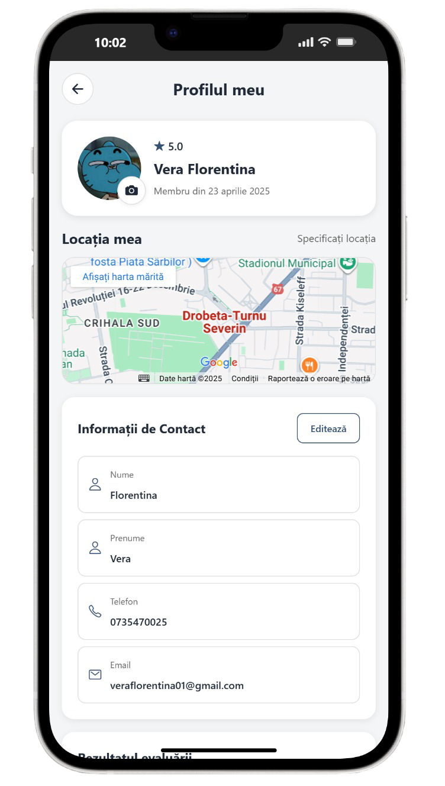
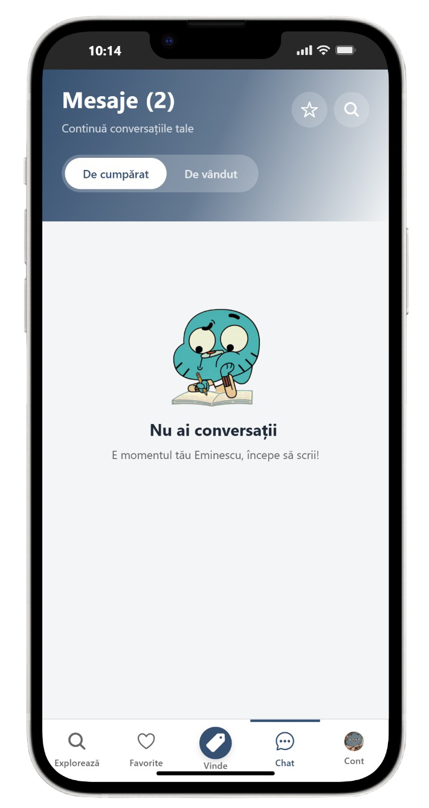
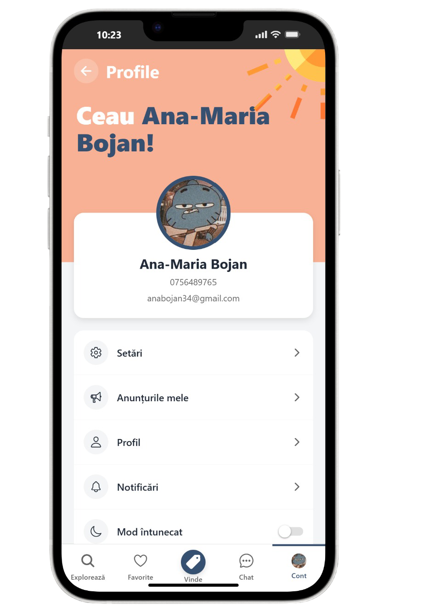

<div align="center">

<a href="https://hobbiz.netlify.app" target="_blank"></a>

# Hobbiz
https://hobbiz.netlify.app/
Gestionare hobby‑uri, skill‑uri și servicii locale. Web (React + MUI) + API Node/Express + aplicație mobilă Expo/React Native
</div>

---

## 🧭 Descriere
Hobbiz este o platformă unde utilizatorii își pot publica anunțuri în vederea monetizarii hobby‑urilor. De ce? Pentru că în ziua de azi nu mai e de ajuns o singură sursă de venit. Aici poți îmbina utilul cu plăcutul!

---

## 📱 Aplicația Mobilă (în lucru)

Hobbiz oferă o experiență mobilă nativă completă dezvoltată cu **Expo** și **React Native**, optimizată pentru iOS și Android. Aplicația permite utilizatorilor să:

- **Exploreze anunțuri** – Navighează prin categorii și descoperă hobby-uri și servicii locale
- **Gestioneze favorite** – Salvează și accesează rapid anunțurile preferate
- **Publice anunțuri** – Creează și editează anunțuri direct de pe dispozitiv cu upload de imagini
- **Comunice în timp real** – Chat privat cu notificări și typing indicators
- **Gestioneze contul** – Profil personalizat cu avatar, setări și autentificare Google OAuth

### Capturi de Ecran(da știu îmi place Gumball, ai vreo problemă?)

<table align="center">
  <tr>
  <td></td>
    <td>&nbsp;&nbsp;</td>
  <td></td>
    <td>&nbsp;&nbsp;</td>
  <td></td>
  </tr>
</table>

### Tehnologii Mobile
- **Expo SDK 54** + React Native 0.81
- **expo-router** pentru navigație declarativă
- **expo-secure-store** pentru stocare criptată
- **axios** pentru comunicare API
- **Socket.IO** pentru realtime updates
- **react-native-safe-area-context** pentru layout adaptat

---

## 🧱 Arhitectură (Monorepo)

```
hobbiz-mui/
│  hobbiz-mui.sln               # (pentru integrare eventuală cu tooling extern)
│  netlify.toml / render.yaml   # Config deploy frontend / backend
│  README.md
│  schiță-db.md                 # Note despre modelarea datelor
│  observatii.txt               # Observații / TODO istoric
│
├─ frontend/                    # Client web (React + Vite + MUI)
│  ├─ index.html
│  ├─ package.json
│  ├─ vite.config.js
│  ├─ public/
│  │  └─ uploads/              # Imagini persistente servite și de backend
│  └─ src/
│     ├─ api/api.js            # Config Axios & interceptori
│     ├─ assets/               # Date statice (ex: comunePeJudet.js)
│     ├─ components/           # Componente UI reutilizabile (CallToAction, Categories, ChatPopup,
│     │                        # DarkModeToggle, Footer, Header, AnnouncementLocationMap, etc.)
│     ├─ context/AuthContext.jsx
│     ├─ pages/                # Pagini routate (Login, Signup, ProfilePage, Add/Edit Announcement,
│     │                        # Favorites, ChatPage, NotificationsPage, Reviews, OAuthSuccess, Legal, etc.)
│     ├─ services/             # (în curs – pentru extragerea logicii de API)
│     ├─ App.jsx / main.jsx    # Bootstrap aplicație
│     ├─ themeTransition.*     # Efecte de tranziție temă/dark-mode
│     ├─ mediaQueries.css      # Breakpoints și adaptări
│     └─ App.css / index.css
│
├─ backend/                     # API REST + WebSocket (Socket.IO)
│  ├─ server.js                # Bootstrap Express + Socket.IO + CORS + sesiuni + endpoints health
│  ├─ build.sh
│  ├─ package.json
│  ├─ config/
│  │  ├─ db.js                 # Conectare MongoDB
│  │  ├─ passport.js           # Google OAuth via Passport
│  │  ├─ cloudinary.js         # Config Cloudinary
│  │  └─ cloudinaryMulter.js   # Multer storage adaptor
│  ├─ middleware/
│  │  ├─ auth.js               # Verificare JWT obligatorie
│  │  └─ optionalAuth.js       # JWT opțional (ex: recenzii publice)
│  ├─ models/                  # Mongoose Schemas (User, Announcement, Review,
│  │  │                          Message, Notification, Alert)
│  ├─ controllers/             # Logică business (User, Message, Notification, Review)
│  ├─ routes/                  # Layer routing REST (vezi secțiunea Rute)
│  ├─ services/                # (extensibil pentru logică suplimentară)
│  ├─ scripts/                 # Seed / utilitare (ex: seedReview.js)
│  └─ mitm-detector.exe        # Executabil detecție MITM (rulat la login)
│
├─ mobile-app/                 # Client mobil (Expo + React Native + expo-router)
│  ├─ app/                     # Rute (layout, login, profile, notifications, tabs, etc.)
│  ├─ components/              # UI & layout reutilizabil
│  ├─ constants/theme.ts       # Temă / culori partajate
│  ├─ hooks/                   # use-color-scheme, use-theme-color
│  ├─ src/ (extensibil)        # Spațiu pentru servicii/context viitoare
│  ├─ assets/                  # Imagini / fonturi
│  └─ package.json
│
└─ render.yaml / netlify.toml  # Config deploy (Render backend / Netlify frontend)
```

---

## 🧪 Modele (Mongoose)
User, Announcement, Message, Notification, Review, Alert.

Elemente notabile:
- User: avatar (upload Cloudinary), favorites (referințe Announcement), googleId.
- Announcement: imagini multiple, views, favoritesCount.
- Message: suport reacții + imagine (upload) + conversation scoping.
- Review: like-uri + author vs. targetUser + optional auth la creare.
- Notification: tip (ex: message, review, favorite), read/unread.

---

## 🔐 Autentificare & Securitate
- JWT (Bearer) + refresh prin re-login (expirare 7d).
- Google OAuth 2.0 (Passport) – redirect către /oauth-success cu token.
- express-session pentru sesiunea Passport (Google flow).
- CORS dinamic cu whitelist + suport pentru subdomenii Netlify.

---

## 💬 Realtime & Chat
Socket.IO pentru:
- Mapare userId -> socketId (activeUsers) pentru mesaje țintite (favoritesUpdated etc.)
- Indicator typing per conversație (`conversationId` compus userId1-userId2)
- Notificări actualizare favorite / mesaje / notificări.

---

## 🌐 Principalele Rute REST (Backend)

Prefix general: /api

Users & Auth (/api/users & /auth)
- POST /api/users/register – înregistrare
- POST /api/users/login – login (JWT)
- GET  /api/users/profile – profil autenticat
- GET  /api/users/profile/:userId – profil public (auth opțional)
- PUT  /api/users/update-email / update-password / profile
- POST /api/users/my-announcements (imagini multiple)
- GET  /api/users/my-announcements
- PUT  /api/users/my-announcements/:id
- DELETE /api/users/my-announcements/:id
- DELETE /api/users/delete-account – șterge cont + anunțuri
- POST /api/users/avatar – upload avatar
- GET  /api/users/auth/check – status autentificare

Announcements (/api/announcements)
- GET / (filtrare opțională category)
- GET /popular?limit=10
- GET /:id (autoincrement views)
- POST/DELETE /:id/favorite (increment/decrement favoritesCount)

Favorites (/api/favorites)
- GET / – lista completă + populate
- POST /:announcementId – adaugă la favorite (sync counter)
- DELETE /:announcementId – elimină

Chat Messages (/api/messages)
- POST / (text + imagine opțională)
- DELETE /:id
- POST /:id/react – toggle/update reacție
- GET  /conversations/:userId – conversațiile utilizatorului
- GET  /between/:userId1/:userId2 – thread specific
- GET  /conversation/:conversationId – mesaje scoped
- PUT  /mark-read/:userId/:otherUserId – marchează citite între doi
- PUT  /conversation/:conversationId/mark-read – citire conversație

Notifications (/api/notifications)
- GET /:userId
- POST /
- PATCH /:id/read
- DELETE /:id

Reviews (/api/reviews)
- GET /:userId – listă recenzii pentru utilizator
- POST / (auth opțional) – creare
- POST /:id/like – like/unlike
- PUT  /:id – update (autor)
- DELETE /:id – ștergere (autor)

Health & Utilitare
- GET /api/health – stare server
- GET /health/db – stare conexiune Mongo

---

## 🧩 Tech Stack

Frontend:
- React 19 + Vite 6
- React Router DOM 7
- Material UI 5 + Emotion
- Axios, jwt-decode
- Socket.IO client (chat & notificări)
- anime.js (efecte UI), react-slick (carusele)

Backend:
- Node.js 18+, Express 4
- MongoDB Atlas + Mongoose 8
- JWT (jsonwebtoken) + bcryptjs
- Passport + passport-google-oauth20 + express-session
- Multer + Cloudinary (multer-storage-cloudinary)
- Socket.IO 4
- CORS, dotenv

Mobile (Expo):
- Expo SDK 54, React Native 0.81
- expo-router pentru navigație declarativă
- axios pentru API, expo-secure-store pentru token

Dev / Tooling:
- ESLint (web & mobile) + configurări dedicate
- Nodemon (backend dev)
- Netlify (frontend deploy), Render (backend), MongoDB Atlas

---

## ✨ Funcționalități Cheie
- Autentificare JWT + Google OAuth
- Gestionare anunțuri (CRUD + imagini multiple + views + favorite count)
- Favorite persistente sincronizate în timp real
- Chat privat cu reacții, typing indicator, atașamente imagine
- Sistem notificări (citire, ștergere, real-time push)
- Recenzii utilizatori (like, edit, delete, anonymous/guest allowed)
- Profil public + avatar + update email / parolă / date personale
- Dark mode + animații de tranziție temă
- Filtrare anunțuri după categorie + popular
- Health endpoints + debug LAN IP pentru testare pe device fizic

---

## 🛡 Securitate & Considerații
- CORS restrictiv cu fallback pentru subdomenii Netlify
- Limită body JSON 5MB (imagini base64 mici)
- Increment atomic views & favoritesCount controlat
- Validări minime în controllers (posibilă extindere cu JOI/Zod)
- Plan: rate limiting, helmet, sanitizare input, refresh token flow.

---

## 🚀 Pornire Locală

Prerechizite: Node >= 18, npm >= 8, cont MongoDB + variabile mediu.

1. Clonează repo & instalează dependențe:
```
npm install --prefix backend
npm install --prefix frontend
npm install --prefix mobile-app
```
2. Creează fișier `backend/.env`:
```
PORT=5000
MONGODB_URI=mongodb+srv://...
JWT_SECRET=schimba_me
SESSION_SECRET=alt_secret
FRONTEND_URL=http://localhost:5173
GOOGLE_CLIENT_ID=...
GOOGLE_CLIENT_SECRET=...
```
3. Rulează backend:
```
npm run dev --prefix backend
```
4. Rulează frontend:
```
npm run dev --prefix frontend
```
5. Rulează aplicația mobilă (Expo):
```
npm start --prefix mobile-app
```
6. Accesează:
- Web: http://localhost:5173
- API: http://localhost:5000/api/health

---

## 🗺 Roadmap (Next)
- Rate limiting (express-rate-limit) & helmet
- Validare schemă request (Zod/Joi)
- Reset parolă via email
- Push Notifications (Web Push + Expo Notifications)
- Căutare full-text (MongoDB Atlas Search)
- Admin dashboard (moderare recenzii/anunțuri)

---

## 📚 Resurse
- React: https://react.dev
- Mongoose: https://mongoosejs.com/docs/guide.html
- Express: https://expressjs.com
- Material UI: https://mui.com
- Socket.IO: https://socket.io/docs/v4
- Expo: https://docs.expo.dev
- Cloudinary: https://cloudinary.com/documentation
- PixelCut.ai: https://www.pixelcut.ai/background-remover

---

## ⚖️ Licență
Momentan proprietar (closed). Se poate adăuga o licență publică ulterior.

---

<div align="center">💡 Feedback & idei sunt binevenite!</div>

