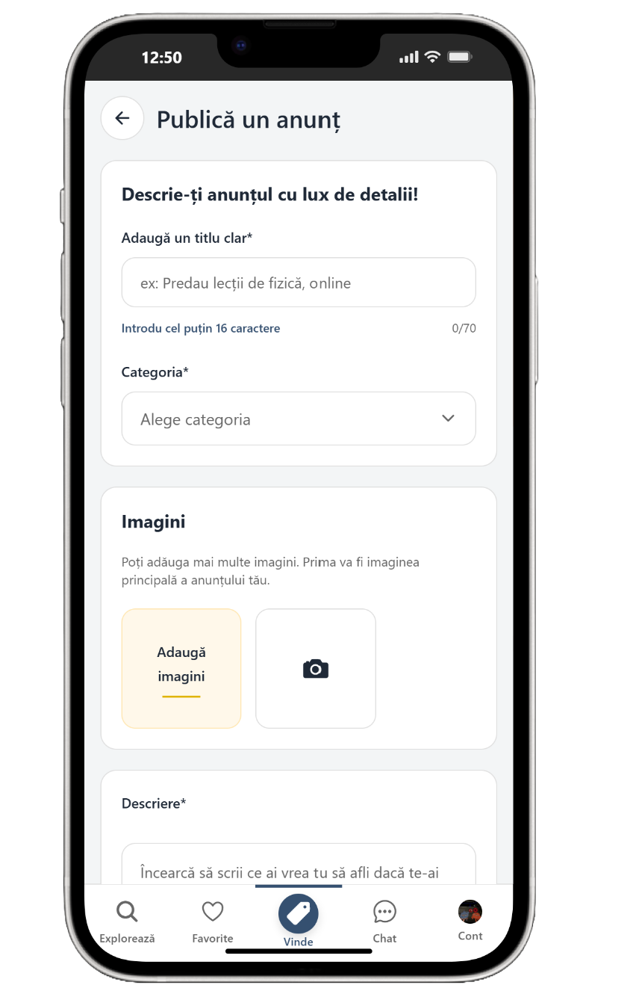
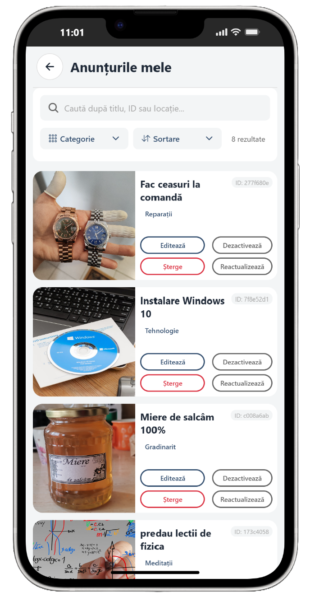
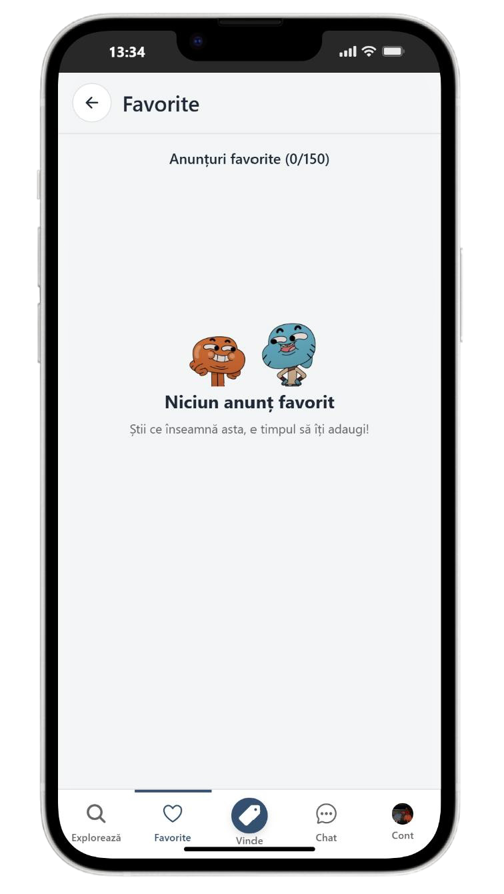

<div align="center">

<a href="https://hobbiz.netlify.app" target="_blank"></a>

# Hobbiz
https://hobbiz.netlify.app/
Gestionare hobby‑uri, skill‑uri și servicii locale. Web (React + MUI) + API Node/Express + aplicație mobilă Expo/React Native
</div>

---

<table>
<tr>
<td width="50%" valign="top">

## 🧭 Descriere

Hobbiz este o platformă unde utilizatorii își pot publica anunțuri în vederea monetizarii hobby‑urilor. De ce? Pentru că în ziua de azi nu mai e de ajuns o singură sursă de venit. Aici poți îmbina utilul cu plăcutul!

Nu ai hobby-uri? Nu e problemă, aici îți poți găsi pasiunile! Te poți conecta cu oameni cu aceleași interese ca tine și să învățați împreună lucruri noi prin intermediul unei comunități vaste și prietenoase. Apoi cine știe, înveți și pe alții!


### 🛠️ Tech Stack

<div style="display:flex;flex-wrap:wrap;gap:8px;align-items:center;margin-top:6px;">
  <a href="https://react.dev" target="_blank"></a>
  <a href="https://vitejs.dev" target="_blank"></a>
  <a href="https://mui.com" target="_blank"></a>
  <a href="https://nodejs.org" target="_blank"></a>
  <a href="https://expressjs.com" target="_blank"></a>
  <a href="https://www.mongodb.com" target="_blank"></a>
  <a href="https://expo.dev" target="_blank"></a>
  <a href="https://reactnative.dev" target="_blank"></a>
  <a href="https://socket.io" target="_blank"></a>
  <a href="https://jwt.io" target="_blank"></a>
</div>

</td>
<td width="50%" valign="top">

<p align="center">
  
</p>

</td>
</tr>
</table>

---

## 📱 Aplicația Mobilă (în lucru)

Hobbiz oferă o experiență mobilă nativă completă dezvoltată cu **Expo** și **React Native**, optimizată pentru iOS și Android. Aplicația permite utilizatorilor să:

- **Exploreze anunțuri** – Navighează prin categorii și descoperă hobby-uri și servicii locale pe care ai vrea să le soliciți
- **Gestioneze favorite** – Salvează și accesezi rapid anunțurile preferate
- **Publice anunțuri** – Creează și editezi anunțuri direct de pe dispozitiv cu upload de imagini
- **Comunice în timp real** – Chat privat cu notificări și typing indicators
- **Gestioneze contul** – Profil personalizat cu avatar, setări și autentificare Google OAuth(în viitor +Facebook, Apple)

### Capturi de Ecran

<table align="center">
  <tr>
    <td style="text-align:center"></td>
    <td>&nbsp;&nbsp;&nbsp;</td>
    <td style="text-align:center"></td>
    <td>&nbsp;&nbsp;&nbsp;</td>
    <td style="text-align:center"></td>
  </tr>
  <tr>
    <td style="height:18px"></td>
  </tr>
  <tr>
    <td style="text-align:center"></td>
    <td>&nbsp;&nbsp;&nbsp;</td>
    <td style="text-align:center"></td>
    <td>&nbsp;&nbsp;&nbsp;</td>
    <td style="text-align:center"></td>
  </tr>
</table>

---

## 🧱 Arhitectură (Monorepo)

Proiectul este organizat ca un monorepo cu trei subproiecte principale (frontend, backend, mobile) și câteva utilitare/support files la rădăcină. Structura relevantă (rezumat):

```
hobbiz-mui/
│  README.md
│  app.json
│  eas.json
│  hobbiz-mui.sln
│  netlify.toml
│  render.yaml
│  LICENSE
│  observatii.txt
│  schiță-db.md
│  package.json
│  README.md
│
├─ backend/                      # API REST + WebSocket (Express + Socket.IO)
│  ├─ server.js                  # bootstrap server
│  ├─ package.json
│  ├─ build.sh
│  ├─ config/                    # config (db, cloudinary, multer, passport)
│  │  ├─ db.js
│  │  ├─ cloudinary.js
│  │  └─ cloudinaryMulter.js
│  ├─ controllers/               # controller logic (User, Message, Notification, Review, ...)
│  ├─ models/                    # Mongoose schemas (User, Announcement, Message, Notification, Review...)
│  ├─ routes/                    # express routes (userRoutes, messageRoutes, notificationRoutes, ...)
│  ├─ middleware/                # auth, optionalAuth etc.
│  ├─ services/                  # backend helper/services
│  └─ scripts/                   # seed & maintenance scripts
│
├─ frontend/                     # Web client (React + Vite + MUI)
│  ├─ package.json
│  ├─ vite.config.js
│  ├─ index.html
│  ├─ public/                     # static assets served by web (uploads used at runtime)
│  └─ src/
│     ├─ api/                    # axios instances & API helpers
│     ├─ assets/                 # site images / static data
│     ├─ components/             # UI components
│     ├─ context/                # React contexts
│     ├─ pages/                  # routed pages
│     └─ styles/
│
├─ mobile-app/                   # Mobile client (Expo + React Native + expo-router)
│  ├─ package.json
│  ├─ app/                       # expo-router routes (settings, notifications, chat, profile, tabs, etc.)
│  │  ├─ _layout.tsx
│  │  ├─ settings.tsx
│  │  ├─ notifications.tsx
│  │  ├─ (tabs)/                 # tabbed routes (chat under (tabs)/chat.tsx)
│  │  └─ ...                     # many route files used by the mobile app
│  ├─ src/                       # mobile-specific services, context, hooks
│  ├─ components/                # mobile UI primitives (Toast, ThemedView/Text, ImageViewer ...)
│  ├─ assets/                    # images, poster.png, fonts
│  └─ android_old/               # legacy Android build files (kept for reference)

├─ device-view_images/           # screenshots used in README
├─ scripts/                      # misc scripts (listReviews.js, test-reaction.js)

``` 

Notă: secțiunile mai detaliate (subfolderele controllers, models, routes etc.) reflectă modul în care backend-ul este structurat pentru a păstra separarea responsabilităților (business logic în controllers, schema în models, rutare în routes). Mobilul folosește `expo-router` pentru a păstra rutele într-un folder `app/`, iar web-ul este un proiect Vite + React separat în folderul `frontend/`.

---

## 🧪 Modele (Mongoose)
User, Announcement, Message, Notification, Review, Alert.

Elemente notabile:
- User: avatar (upload Cloudinary), favorites (referințe Announcement), googleId.
- Announcement: imagini multiple, views, favoritesCount.
- Message: suport reacții + imagine (upload) + conversation scoping.
- Review: like-uri + author vs. targetUser + optional auth la creare.
- Notification: tip (ex: message, review, favorite), read/unread.

---

## 💬 Realtime & Chat
Socket.IO pentru:
- Mapare userId -> socketId (activeUsers) pentru mesaje țintite (favoritesUpdated etc.)
- Indicator typing per conversație (`conversationId` compus userId1-userId2)
- Notificări actualizare favorite / mesaje / notificări.

---

## 🌐 Principalele Rute REST (Backend)

Prefix general: /api

Users & Auth (/api/users & /auth)
- POST /api/users/register – înregistrare
- POST /api/users/login – login (JWT)
- GET  /api/users/profile – profil autenticat
- GET  /api/users/profile/:userId – profil public (auth opțional)
- PUT  /api/users/update-email / update-password / profile
- POST /api/users/my-announcements (imagini multiple)
- GET  /api/users/my-announcements
- PUT  /api/users/my-announcements/:id
- DELETE /api/users/my-announcements/:id
- DELETE /api/users/delete-account – șterge cont + anunțuri
- POST /api/users/avatar – upload avatar
- GET  /api/users/auth/check – status autentificare

Announcements (/api/announcements)
- GET / (filtrare opțională category)
- GET /popular?limit=10
- GET /:id (autoincrement views)
- POST/DELETE /:id/favorite (increment/decrement favoritesCount)

Favorites (/api/favorites)
- GET / – lista completă + populate
- POST /:announcementId – adaugă la favorite (sync counter)
- DELETE /:announcementId – elimină

Chat Messages (/api/messages)
- POST / (text + imagine opțională)
- DELETE /:id
- POST /:id/react – toggle/update reacție
- GET  /conversations/:userId – conversațiile utilizatorului
- GET  /between/:userId1/:userId2 – thread specific
- GET  /conversation/:conversationId – mesaje scoped
- PUT  /mark-read/:userId/:otherUserId – marchează citite între doi
- PUT  /conversation/:conversationId/mark-read – citire conversație

Notifications (/api/notifications)
- GET /:userId
- POST /
- PATCH /:id/read
- DELETE /:id

Reviews (/api/reviews)
- GET /:userId – listă recenzii pentru utilizator
- POST / (auth opțional) – creare
- POST /:id/like – like/unlike
- PUT  /:id – update (autor)
- DELETE /:id – ștergere (autor)

Health & Utilitare
- GET /api/health – stare server
- GET /health/db – stare conexiune Mongo

---

## 🧩 Tech Stack

Frontend:
- React 19 + Vite 6
- React Router DOM 7
- Material UI 5 + Emotion
- Axios, jwt-decode
- Socket.IO client (chat & notificări)

Backend:
- Node.js 18+, Express 4
- MongoDB Atlas + Mongoose 8
- JWT (jsonwebtoken) + bcryptjs
- Passport + passport-google-oauth20 + express-session
- Multer + Cloudinary (multer-storage-cloudinary)
- Socket.IO 4

Mobile (Expo):
- Expo SDK 54, React Native 0.81
- expo-router pentru navigație declarativă
- axios pentru API, expo-secure-store pentru token

Dev / Tooling:
- ESLint (web & mobile) + configurări dedicate
- Nodemon (backend dev)

---

## 🗺 Roadmap (Next)
- Rate limiting (express-rate-limit) & helmet
- Validare schemă request (Zod/Joi)
- Reset parolă via email
- Push Notifications (Web Push + Expo Notifications)
- Căutare full-text (MongoDB Atlas Search)
- Admin dashboard (moderare recenzii/anunțuri)

---

## 📚 Resurse
- React: https://react.dev
- Mongoose: https://mongoosejs.com/docs/guide.html
- Express: https://expressjs.com
- Material UI: https://mui.com
- Socket.IO: https://socket.io/docs/v4
- Expo: https://docs.expo.dev
- Cloudinary: https://cloudinary.com/documentation
- Adobe background remover: https://www.adobe.com/express/feature/image/remove-background

---

## ⚖️ Licență
Copyright (c) 2025 Hobbiz. All rights reserved.

---

<div align="center">💡 Feedback & idei sunt binevenite!</div>

